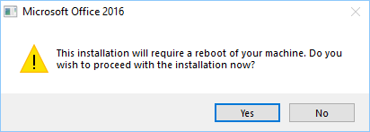

A generic dialog box to display custom messages to the user without the toolkit branding using the function “Show-DialogBox”. This can be customized with different system icons and buttons.

## Logging

The toolkit generates extensive logging for all toolkit and MSI operations.

The default log directory for the toolkit and MSI log files can be specified in the XML configuration file. The default directory is \<C:\\Windows\\Logs\\Software\>.

The toolkit log file is named after the application with \_PSAppDeployToolkit appended to the end, e.g.

Oracle\_JavaRuntime\_1.7.0.17\_EN\_01**\_PSAppDeployToolkit.log**

All MSI actions are logged and the log file is named according to the MSI file used on the command line, with the action appended to the log file name. For uninstallations, the MSI product code is resolved to the MSI application name and version to keep the same log file format, e.g.

Oracle\_JavaRuntimeEnvironmentx86\_1.7.0.17\_EN\_01**\_Install.log**

Oracle\_JavaRuntimeEnvironmentx86\_1.7.0.17\_EN\_01**\_Repair.log**

Oracle\_JavaRuntimeEnvironmentx86\_1.7.0.17\_EN\_01**\_Patch.log**

Oracle\_JavaRuntimeEnvironmentx86\_1.7.0.17\_EN\_01**\_Uninstall.log**

# Toolkit Usage

## Overview

The Deploy-Application.ps1 script is the only script you need to modify to deploy your application.

The Deploy-Application.ps1 is broken down into the following sections:

**Initialization** e.g. Variables such as App Vendor, App Name, App Version

**Pre-Installation** e.g. Close applications, uninstall or clean-up previous versions

**Installation** e.g. Install the primary application, or components of the application

**Post-Installation** e.g. Drop additional files, registry tweaks

**Uninstallation** e.g. Uninstall/rollback the changes performed in the install section.

## Launching the Toolkit
